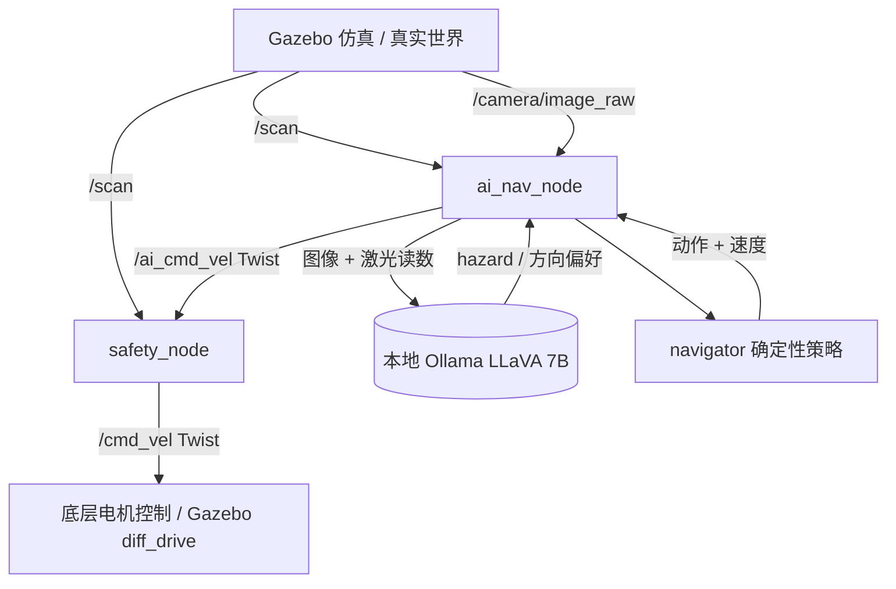

# 智能导航机器人: ROS2 与 LLM 端到端自动驾驶总结

> [!NOTE]
> 本文档总结 1 线 LiDAR + 摄像头机器人的端到端大模型驾驶架构。代码位于 `src/ai_robot_nav/`，在 WSL2 (Ubuntu 24.04 + ROS2 Jazzy) Gazebo 仿真运行。

## 1. 核心架构设计

代码库包含两个 Python 节点，由 `launch/ai_nav.launch.py` 统一启动。



### 1.1 决策层（`ai_nav_node.py` + `navigator.py`）
- 订阅 `/scan`、`/camera/image_raw`（`qos_profile_sensor_data`）
- LiDAR 扇区最小距离由 `scan_utils` 从 `angle_min`/`angle_increment` 反算，不假设 1 点 = 1 度
- 相机帧在推理线程内按需转 320x240 JPEG Base64，回调只存原始消息
- **速度由 `navigator.py` 从激光几何确定性算出**，模型不参与数值计算
- 模型只返回 `{hazard, preferred_direction}`，且只能单向收紧：标记前方不可通行、
  按 `caution_scale` 降速、或在左右空间相近时打破平局；不能提速、不能导向封闭一侧
- 模型不可用或图像陈旧时按纯激光继续导航（`lidar_only_fallback`）
- 传感器超过 `sensor_timeout` 未更新即发零速，不基于陈旧快照驾驶
- 快速控制定时器以 `command_publish_rate` 独立计算激光决策，不等待 Ollama
- 视觉线程只异步更新提示；提示超过 `vision_ttl` 后丢弃并自动退回纯激光

### 1.2 极速硬安全层（`safety_node.py`）
- 订阅 `/scan`、`/ai_cmd_vel`，是 `/cmd_vel` 的唯一发布者，固定 20Hz 主动发布
- 正前方 +/-20 度、`stop_distance` 内障碍 -> 紧急状态，前进归零，保留后退与转向以脱困
- 双看门狗：AI 指令或激光任一断流，均在一个超时周期内衰减到停车
- 停车区带迟滞；所有输出按 `max_linear` / `max_angular` 限幅

## 2. 软件运行指南 (WSL2)

```bash
# 终端1: Gazebo
export TURTLEBOT3_MODEL=waffle
export QT_QPA_PLATFORM=xcb
export MESA_D3D12_DEFAULT_ADAPTER_NAME=NVIDIA
source ~/ros2_ws/install/setup.bash
ros2 launch turtlebot3_gazebo turtlebot3_world.launch.py

# 终端2: 双节点
source ~/ros2_ws/install/setup.bash
ros2 launch ai_robot_nav ai_nav.launch.py
```

## 3. 实车部署 (Jetson)
1. 拷贝 `ROS2_AI_Robot_Workspace` 到 Jetson，`rosdep install --from-paths src --ignore-src -r -y` 后 `colcon build`
2. 指向笔记本的局域网 Ollama，无需改源码：

```bash
ros2 launch ai_robot_nav ai_nav.launch.py \
    ollama_url:=http://192.168.1.100:11434/api/generate
```

   笔记本侧需 `OLLAMA_HOST=0.0.0.0 ollama serve` 才会监听局域网。
3. 话题名不一致时改 `config/ai_nav_params.yaml` 的 `scan_topic` / `image_topic` / `cmd_topic`，
   或传自己的 `params_file:=/path/to/my_robot.yaml`
4. 实车速度上限按底盘改 `max_linear` / `max_angular`（默认为 TurtleBot3 的 0.22 / 1.5）